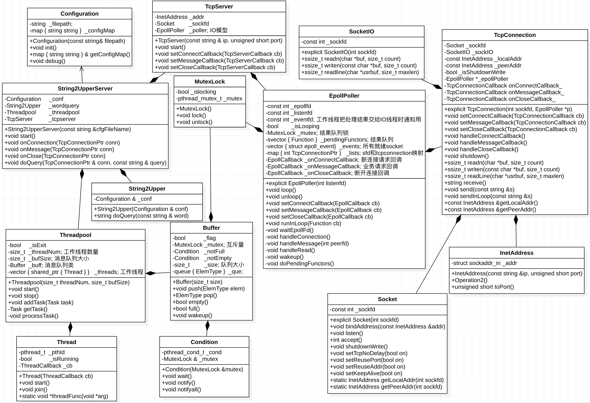
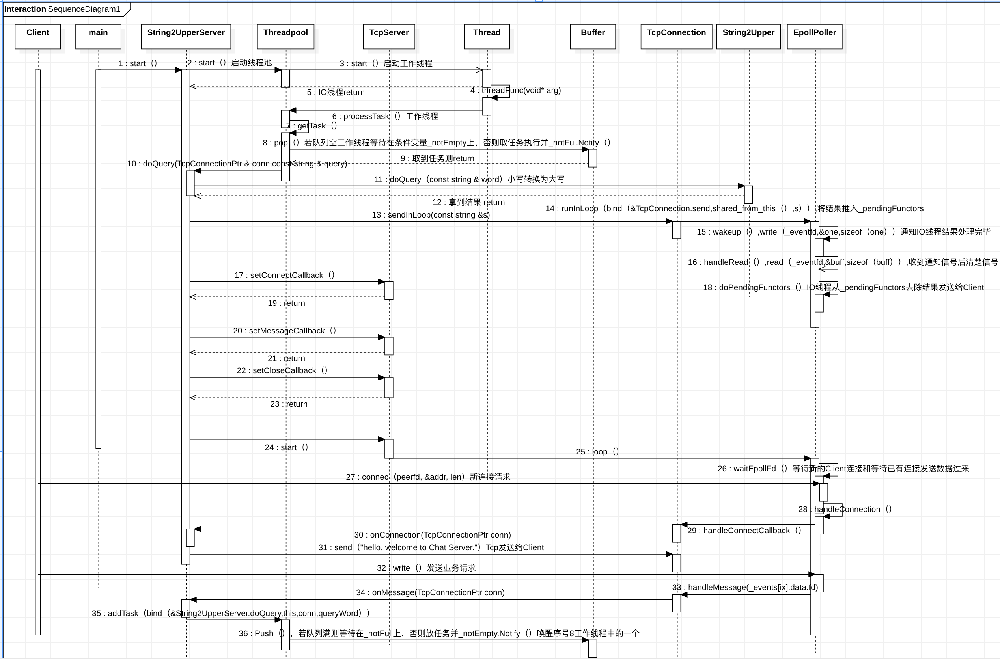
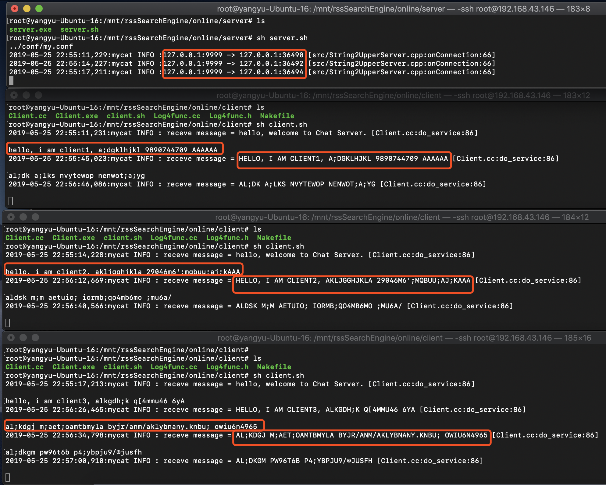
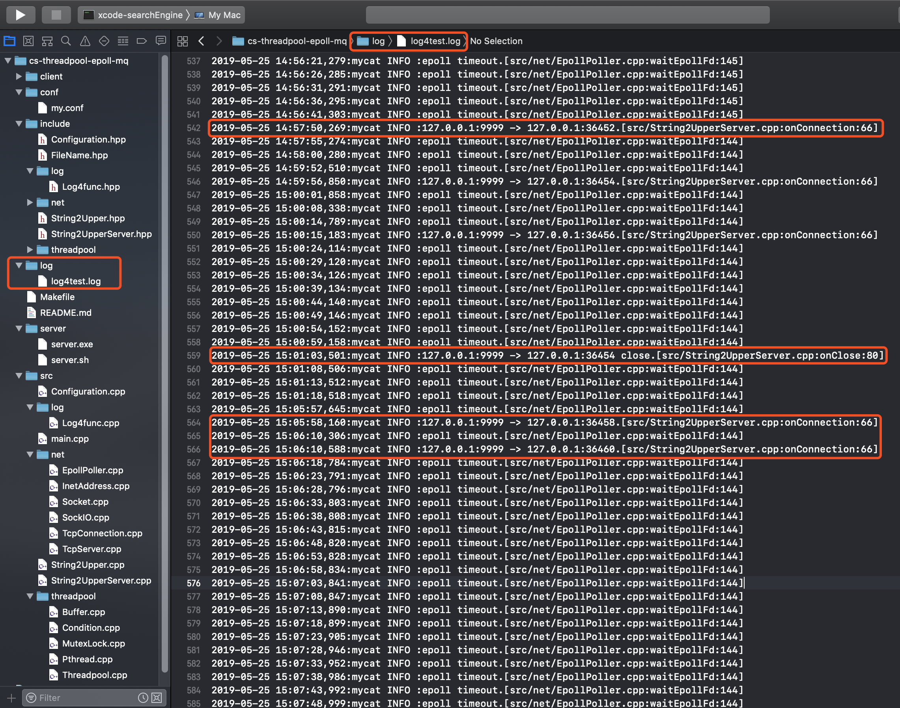

## [本文博客链接](https://icoty.github.io/2019/05/25/cs-threadpool-message-queue/)


## 引言

并发是什么？企业在进行产品开发过程中为什么需要考虑这个问题？想象一下天猫的双11和京东的618活动，一秒的点击量就有几十万甚至上百万，这么多请求一下子涌入到服务器，服务器需要对这么多的请求逐个进行消化掉，假如服务器一秒的处理能力就几万，那么剩下的不能及时得到处理的这些请求作何处理？总不能让用户界面一直等着，因此消息队列应运而生，所有的请求都统一放入消息队列，工作线程从消息队列不断的消费，消息队列相当于一个缓冲区，可达到解藕、异步和削峰的目的。

Kafka、ActiveMQ、RabbitMQ和RockerMQ都是消息队列的典型，每一种都有其自身的优势和劣势。本文我用自己编写的Buffer类模拟消息队列，如果是企业级需要上线的应用，一般都是基于业界已有的MQ框架上开发。

## 需求原型

1. N个Client从标准输入接收数据，然后连续不断的发送到Server端；
2. Server端接收来自每个Client的数据，将数据中的小写字母全部转换成大写字母，其他字符保持不变，最后把转换结果发送给对应的Client。

## 需求分解

1. 拿到需求，第一步要做的就是分析需求并选择合适的设计架构，考虑到Server需要和Client进行通信，Client来自四面八方，端对端通信自然选择TCP，因此Server端需要能够监听新的连接请求和已有连接的业务请求；
2. 又由于Server需要响应多个Client的业务请求，我们希望把业务处理交给Server端的工作线程（消费者）来做；
3. 同时还需要一个IO线程负责监听Socket描述符，当IO线程监听到已有连接的业务请求时，立即把请求内容封装成一个任务推入消息队列尾；
4. IO线程与工作线程互斥访问消息队列，当然工作线程消费一个任务或者IO线程添加一个任务都需要通知对方，也就是同步；
5. 工作线程处理完毕后，把处理结果交给IO线程，由IO线程负责把结果发送给对应的Client，也就是IO线程与工作线程的分离，这里工作线程通知IO线程的方式我用eventfd来实现；
6. 我们希望引入Log4cpp记录服务端的日志，并能够保存到文件中；
6. 分析完这些，一个整体架构和大体的样子在脑海中就已经形成了，接着就需要编写设计文档和画流程图、类图和时序图了。

## 详细设计文档

1. uml静态类图：


2. uml动态时序图：


## 效果
1. 如图，开了三个Client，运行结果正确：


2. Server端通过Log4cpp把日志写到文件中：


## 目录结构
 
```bash
.
├── client // 客户端Demo
│   ├── Client.cc
│   ├── Client.exe
│   ├── client.sh // 进入该目录下启动Client Demo: sh client.sh
│   ├── Log4func.cc // 引入日志模块重新疯转
│   ├── Log4func.h
│   └── Makefile // 编译方式：make
├── conf
│   └── my.conf // IP,Port配置文件, 从这里进行修改
├── include // 头文件
│   ├── Configuration.hpp // 配置文件,单例类,my.conf的内存化
│   ├── FileName.hpp // 全局定义,Configuration会用到
│   ├── log // 日志模块头文件
│   │   └── Log4func.hpp
│   ├── net // 网络框架模块头文件
│   │   ├── EpollPoller.hpp
│   │   ├── InetAddress.hpp
│   │   ├── Socket.hpp
│   │   ├── SockIO.hpp
│   │   ├── TcpConnection.hpp
│   │   └── TcpServer.hpp
│   ├── String2Upper.hpp // 工作线程转换成大写实际走的这里面的接口
│   ├── String2UpperServer.hpp // Server端的整个工厂
│   └── threadpool // 线程池、锁、条件变量和消息队列的封装
│       ├── Buffer.hpp
│       ├── Condition.hpp
│       ├── MutexLock.hpp
│       ├── Noncopyable.hpp
│       ├── Pthread.hpp
│       ├── Task.hpp
│       └── Threadpool.hpp
├── log // Server端的日志通过Log4cpp记录到这个文件中
│   └── log4test.log
├── Makefile // 编译方式：make
├── README.md 
├── server // server端Demo
│   ├── server.exe
│   └── server.sh // 进入该目录下启动Server Demo：sh server.sh
└── src // 源文件
    ├── Configuration.cpp
    ├── log
    │   └── Log4func.cpp
    ├── main.cpp
    ├── net
    │   ├── EpollPoller.cpp
    │   ├── InetAddress.cpp
    │   ├── Socket.cpp
    │   ├── SockIO.cpp
    │   ├── TcpConnection.cpp
    │   └── TcpServer.cpp
    ├── String2Upper.cpp
    ├── String2UpperServer.cpp
    └── threadpool
        ├── Buffer.cpp
        ├── Condition.cpp
        ├── MutexLock.cpp // MutexLockGuard封装
        ├── Pthread.cpp
        └── Threadpool.cpp
```

## 参考文献

[1] UNIX环境高级编程第3版<br>
[2] [cpp reference](https://en.cppreference.com/w/)<br>
[3] [UML时序图](https://www.cnblogs.com/downey/p/4890830.html)<br>
[4] [Log4cpp官网下载](https://sourceforge.net/projects/log4cpp/)<br>
[5] [Log4cpp安装](https://blog.csdn.net/sinat_26003209/article/details/46522953)<br>
